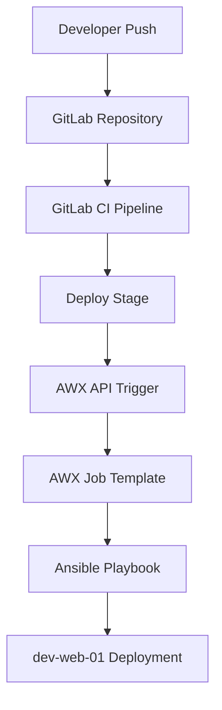
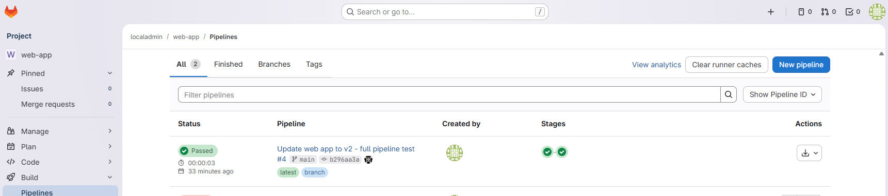
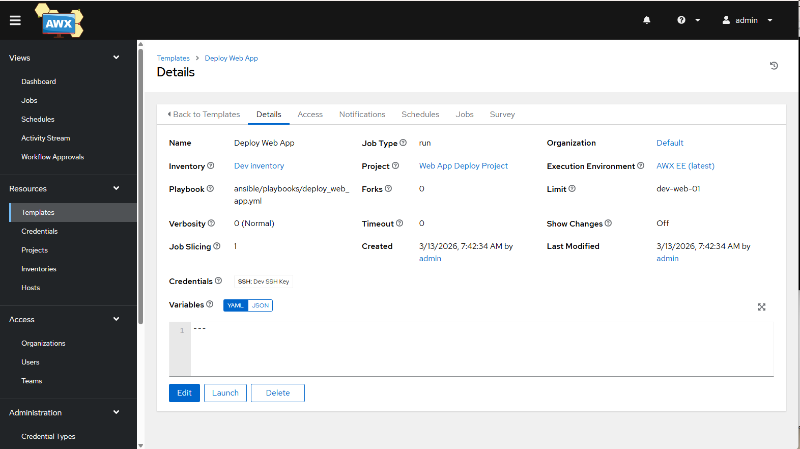
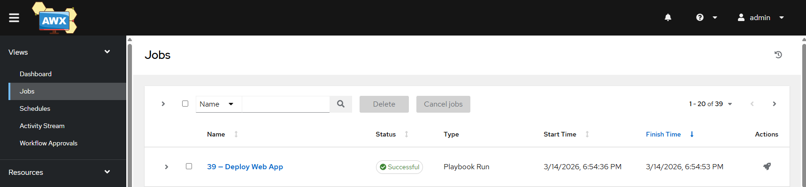
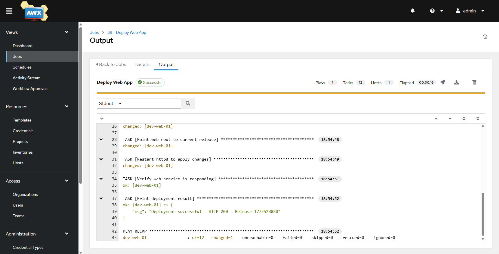
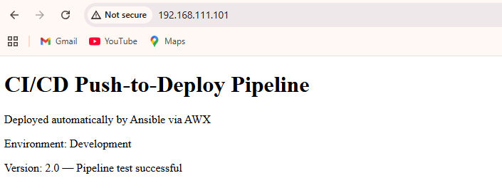

# CI/CD Push-to-Deploy Pipeline

Automated GitOps deployment pipeline integrating GitLab CI with AWX (Ansible Automation
Platform). A single `git push` triggers a two-stage pipeline that calls the AWX API,
which runs an Ansible playbook pulling and deploying the application to a Rocky Linux server.

---

## Pipeline Architecture



---

## Technologies

| Technology    | Purpose                     |
| ------------- | --------------------------- |
| GitLab CE     | Source control and CI/CD    |
| AWX           | Ansible Automation Platform |
| Ansible       | Deployment automation       |
| Rocky Linux 9 | Target server OS            |
| Apache HTTPD  | Web service                 |

---

## Environment

| Host       | Role            | IP              |
| ---------- | --------------- | --------------- |
| gitlab     | Source & CI/CD  | 192.168.111.10  |
| awx        | Automation      | 192.168.111.30  |
| dev-web-01 | Deploy target   | 192.168.111.101 |

---

## Pipeline Stages

**Stage 1 — build**
Validates application files before deployment is allowed to proceed.
Uses `set -e` for defensive error handling.

**Stage 2 — deploy**
Calls the AWX REST API to launch the `Deploy Web App` job template.
Validates the HTTP 201 response before marking the stage as passed.
AWX runs an Ansible playbook that pulls the latest code from GitLab
directly onto the target server using the `git` module (true GitOps).

---

## Deployment Strategy

Each deployment creates a timestamped release directory. This is verified live on the server:

```
[ladmin@dev-web-01 ~]$ ls /var/www/releases
1773528880  1773531036

[ladmin@dev-web-01 ~]$ ls -la /var/www/current
lrwxrwxrwx. 1 root root 32 Mar 14 19:30 /var/www/current -> /var/www/releases/1773531036/app
```

```
/var/www/releases/
    1773528880/    ← previous release
    1773531036/    ← current release  ← symlink points here
```

Rolling back requires only pointing the symlink to a previous release
and restarting httpd — no re-deployment needed. This mirrors the pattern
used by Capistrano, Laravel Forge, and production GitOps workflows.

---

## Security Notes

- AWX API token stored as a masked GitLab CI variable — never in code
- SSH key-based authentication from AWX to target servers
- Production improvement: place HTTPS + NGINX reverse proxy in front of AWX

---

## Screenshots

### GitLab Pipeline


### AWX Job Template Configuration


### AWX Job Execution


### AWX Ansible Output


### Deployed Application


---

## DevOps Skills Demonstrated

- CI/CD pipeline design (multi-stage with defensive error handling)
- API-based automation between tools
- Infrastructure as Code
- Configuration management with Ansible
- GitOps deployment pattern
- Symlink-based release management and rollback strategy
- Token-based authentication between CI/CD and automation platforms
- Linux system administration

---

## Part of DevOps Portfolio

- [Project 1 — Enterprise Infrastructure Automation Lab](https://github.com/proclaudio/enterprise-infrastructure-automation-lab)
- **Project 2 — CI/CD Push-to-Deploy Pipeline** (this repo)
